Có thể xem các bài lab trong [lab tutorial](https://github.com/solliancenet/udacity-intro-to-ml-labs)

Ngoài ra mình có note và tạo playlist các clip về lab ở trong từng file cụ thể:
- [1.labs-model-training.md](1.labs-model-training.md)
- [2.labs-algorithms.md](2.labs-algorithms.md)
- [3.labs-deep-learning.md](3.labs-deep-learning.md)
- [4.labs-manage-services.md](4.labs-manage-services.md)

# I. Monitor dataset => detect data drift
- compare data dùng để train và data inference theo tgian
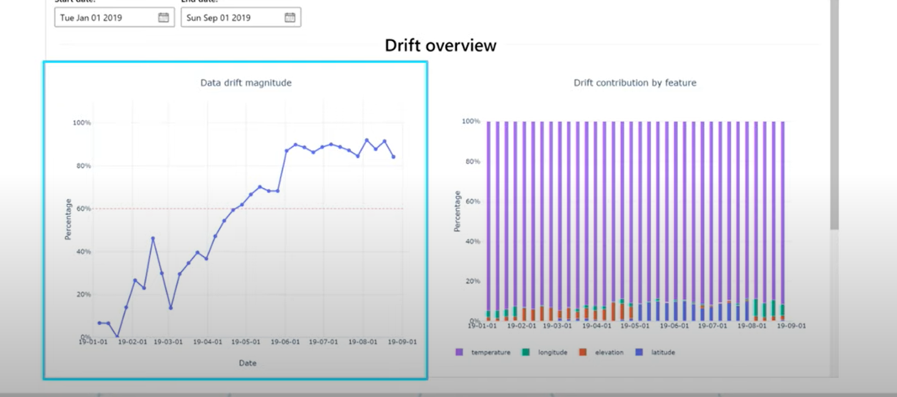

# II. azureml workspace
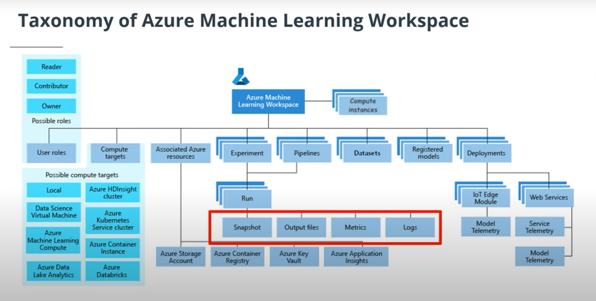

# III. ML algorithm in azure
- [azure ml algorithm cheatsheet](assets/azure-machine-learning-algorithm-cheat-sheet-nov2019.pdf) => tổng hợp các algorithm đang có trên azure

## classification

1. two class
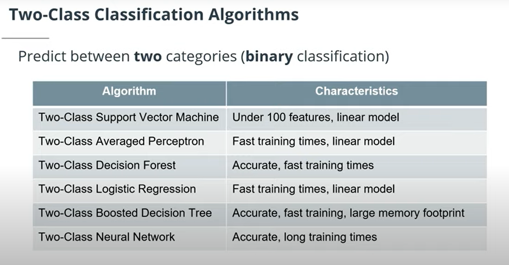

2. multi class
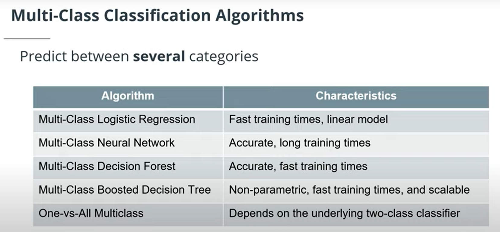

## regression

1. linear regression
2. decision forest regression (RF)
3. NN regression
4. boosted decision tree regression (~lgbm)

## 4 loại clustering algorithm type
(tuy nhiên mình thấy trong designer chỉ có Kmeans)

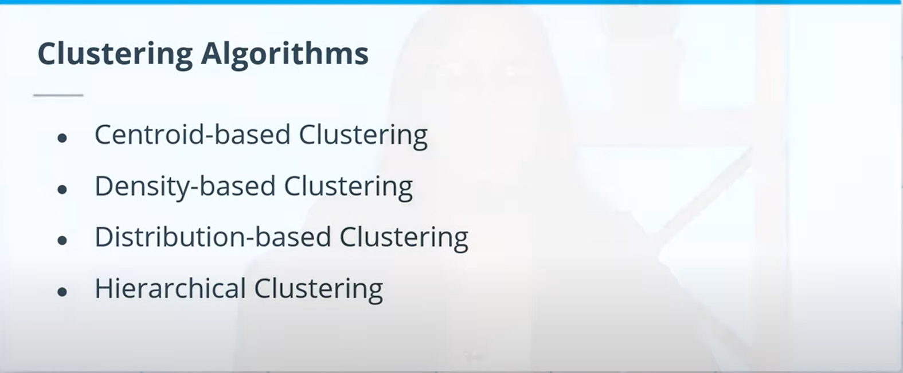

## semi-supervised learning

# IV. automl process
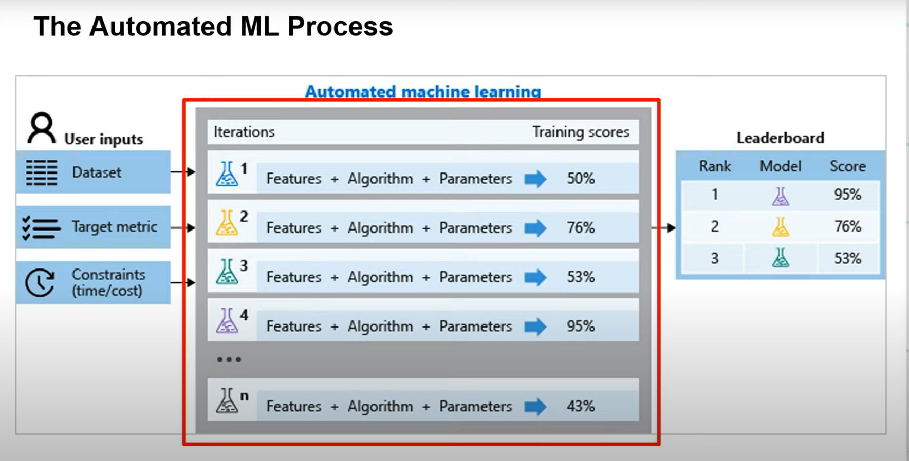

# V. Deep Learning

# VI. Manage-services

## 1. Notebook
- fai dùng `computer instance` để run notebook

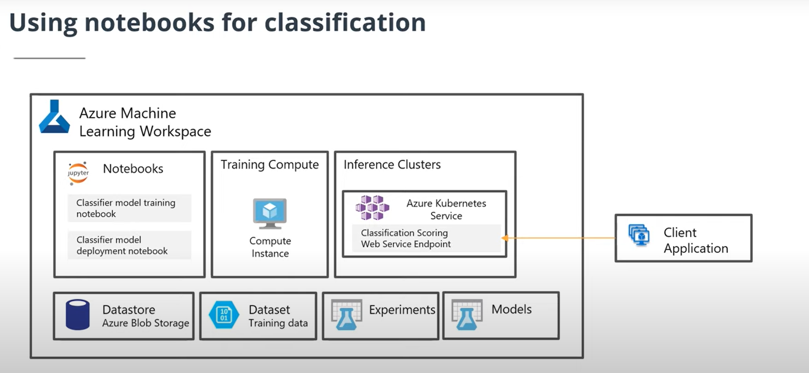

## 2. Training

- training có thể dùng local, computer instance, computer cluster, attach resource.

- computer cluster có thể dùng để batch-inference

## 3. Deploy

có 3 cách register model:
- manual web
- python sdk
- designer (model sau khi train sẽ đc auto register) 

Có 2 trường hợp:
- Batch inference
- Realtime inference

`Batch-inference` => có thể dùng training cluster

`Realtime-inference` => azure package model và inference script vào container => có thể dùng Azure container instance (ACI) => test hoặc depvelop. và azure kubernetes services (AKS) => production

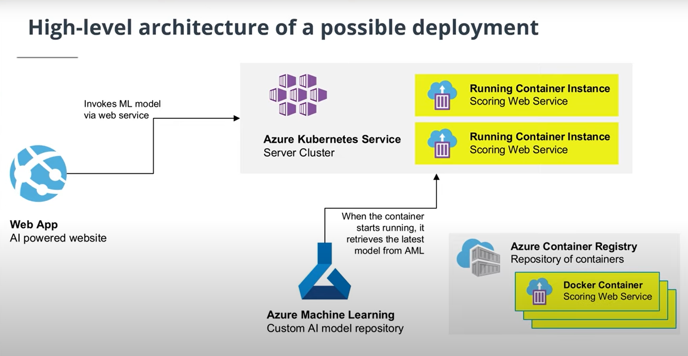

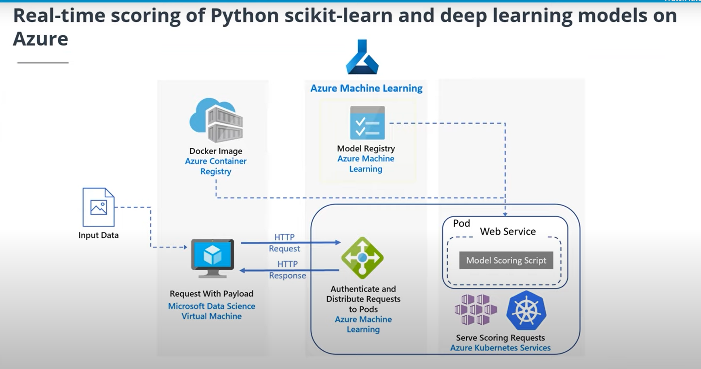

## 4. Pipeline
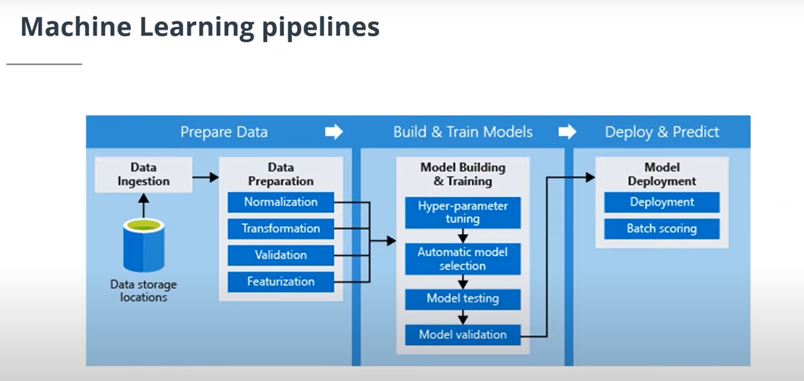

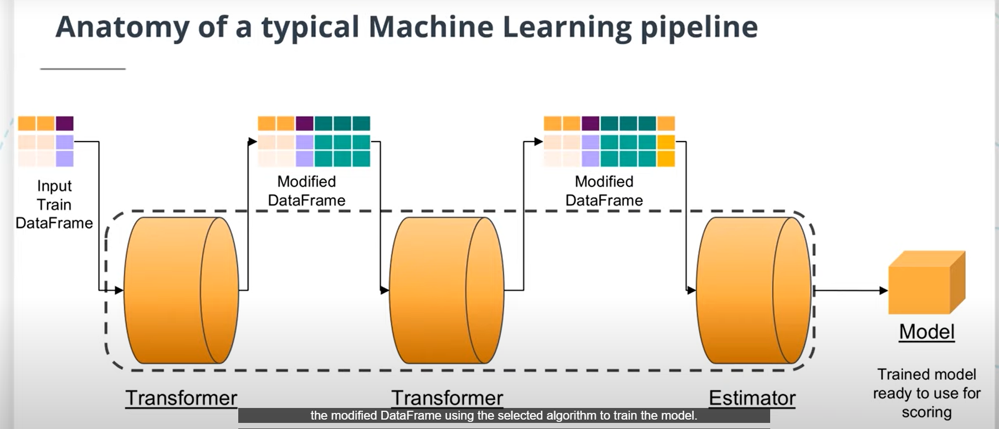

## 5. Experiments & run

có thể hình dung experiments là 1 lần chạy file notebook training 

còn run là những lần run vs hyperparameter khác nhau trong notebook đó => 1 lần run thường tạo ra 1 model

(mình nhớ là experiments ở neptune.ai giống vs run)

# Note
- trong course này, mentors định nghĩa scoring tương ứng vs predict (inference) => cần chú ý nếu ko sẽ khó hiểu vs những "Model Scoring script", "Scoring web service",...

- khi train từ notebook, folder `outputs` sẽ đc auto upload lên azureml workspace, ở trong Experiments/Run. Ngoài ra sẽ có 1 snapshot folder chứa file script đang train